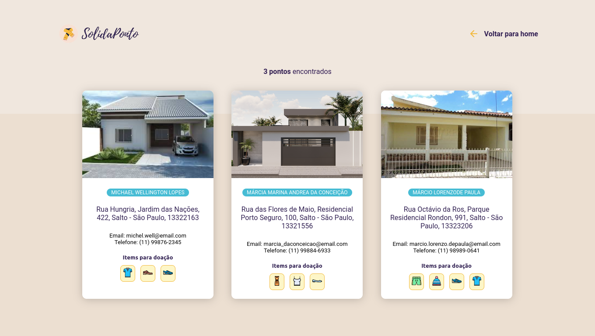
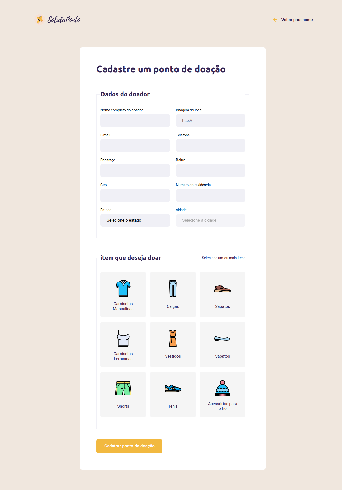

<h1 align="center">
  
</h1>

## 🌟 O que é o SolidaPonto?

O SolidaPonto é mais do que apenas uma aplicação web. É um convite para espalhar um pouco de bondade e solidariedade pelo mundo! 💖 Basicamente, é uma plataforma onde pessoas de bom coração podem se cadastrar e doar roupas para aqueles que mais precisam.

## Tecnologias

- Node.js
- Expressjs
- Nunjucks
- Sucrase
- Sqlite
-

## 👩‍💻 O Desafio Tecnológico: Node.js, Nunjucks e SQLite

Ao longo do desenvolvimento do SolidaPonto, eu mergulhei fundo no universo do Node.js, Express e SQLite. Foi uma jornada incrível, onde cada linha de código foi uma oportunidade para aprender algo novo e desafiar minhas habilidades de desenvolvimento. 💻💡

## 🎨 Design com Coração: Cores, Fontes e Imagens

Não poderia deixar de mencionar o aspecto visual do SolidaPonto! Investi um tempinho extra para garantir que cada detalhe refletisse a essência da solidariedade e empatia. Cores calorosas, fontes acolhedoras e imagens que inspiram generosidade - tudo isso faz parte da experiência do usuário no SolidaPonto! 🎨✨

## 🔍 Inspirado por Padrões de Projeto e Criatividade Ilimitada

Durante o processo de criação, me inspirei em padrões de projeto já existentes, mas dei um toque único e inovador ao SolidaPonto. Adicionei recursos que tornam a experiência do usuário mais fluida e intuitiva, enquanto mantive a simplicidade e eficácia como prioridades.

## 📸 Imagens do

<h1 align="center">
  
  
  
  
</h1>

Feito com :purple_heart: by [Michael W.Lopes](https://github.com/michael23-lopes)

